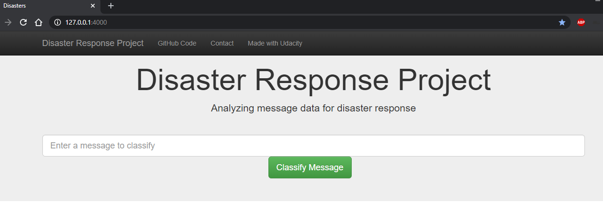
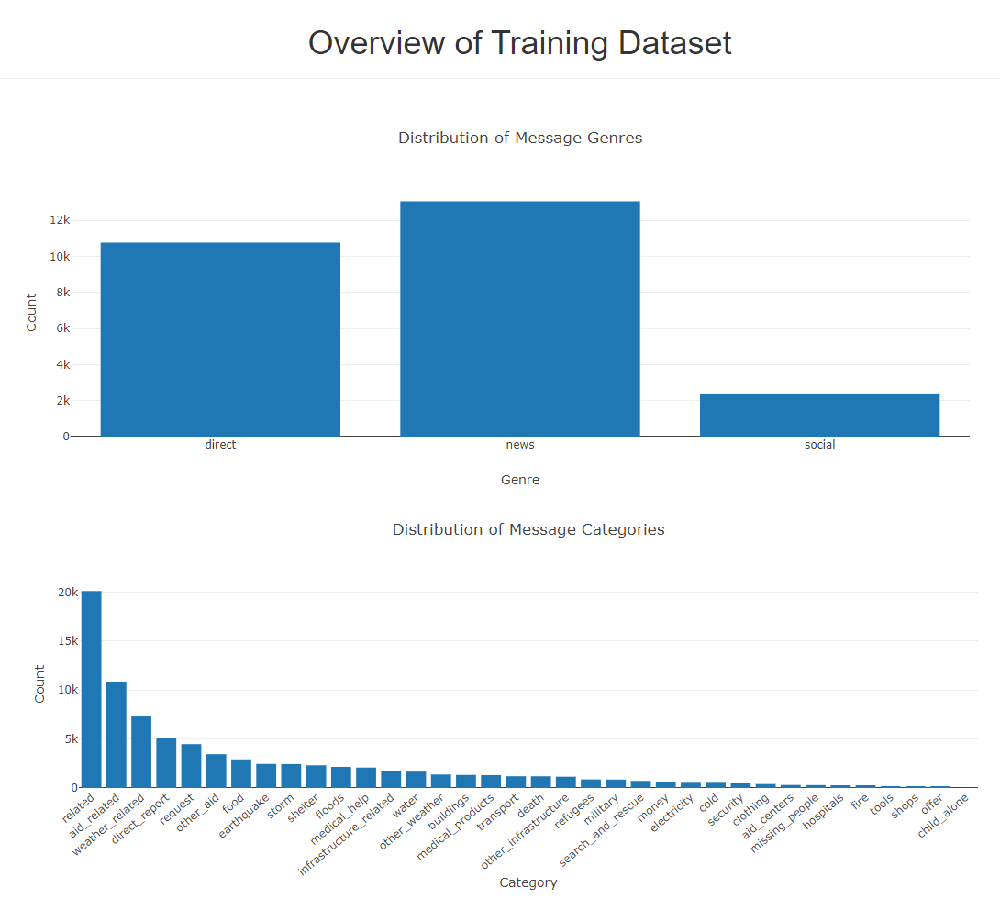
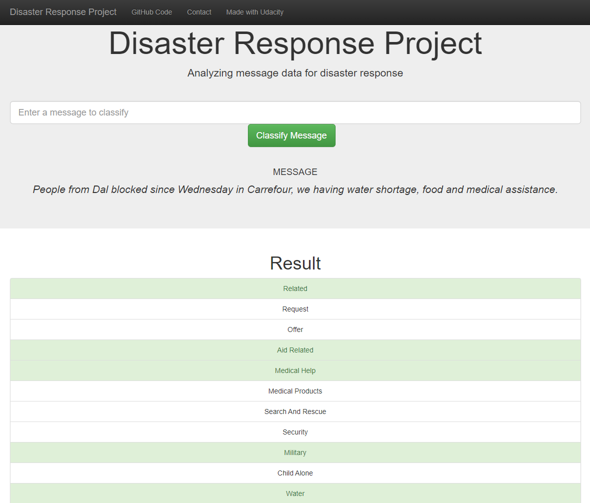

# Disaster Response Pipeline Project

## Table of Contents
1. [Introduction](#introduction)
2. [Project Components](#components)\
    2.1. [ETL Pipeline](#etlpipe)\
    2.2. [ML Pipeline](#mlpipe)\
    2.3. [Flask Web App](#webapp)
3. [Program](#program)\
    3.1. [Dependencies](#dependencies)\
    3.2. [Running](#running)\
    3.3. [Additional Material](#additional)
4. [Acknowledgement](#acknowledgement)
5. [Screenshots](#screenshots)

## 1. Introduction
This Project is part of the Data Science Nanodegree Program given by Udacity in
collaboration with Figure Eight.

The initial dataset contains pre-labelled messages that were sent during
disaster events.

The aim of the project is to build a Natural Language Processing tool to categorize
messages.

## 2. Project components
There are three main components.

### 2.1 ETL Pipeline
File `process_data.py` contains a ETL (Extract, Transform and Load
  Pipeline) that:
- Loads the `messages` and `categories` datasets
- Merges the two datasets
- Cleans the data
- Stores it in a SQLite database

### 2.2 ML Pipeline
File `train_classifier.py` contains a Machine Learning Pipeline that:
- Loads data from the SQLite database
- Splits the dataset into training and test sets
- Builds a text processing and machine learning pipeline
- Trains and tunes a model using GridSearchCV
- Outputs results on the test set
- Exports the final model as a pickle file

### 2.3 Flask Web App
File `run.py` builds a webapp where users can input a message and it will be
classified with the previously trained model.

## 3. Program

### 3.1 Dependencies
* Python 3.5+
* Machine Learning Libraries: NumPy, Pandas, Scikit-Learn
* Natural Language Process Libraries: NLTK
* SQLlite Database Libraries: SQLalchemy
* Web App and Data Visualization: Flask, Plotly

### 3.2 Running:
Run the following commands in the project's root directory to set up your
database and model.
Note that steps 1 and 2 (ETL and ML) are optional because the model already
trained is in the repository.

1. To run the ETL pipeline that cleans data and stores in database:
    `python data/process_data.py data/disaster_messages.csv data/disaster_categories.csv data/DisasterResponse.db`
2. To run the ML pipeline that trains and saves the classifier:
    `python models/train_classifier.py data/DisasterResponse.db models/classifier.pkl`
3. To run the webapp (run it from the app's directory):
    `python run.py`
4. Go to http://127.0.0.1:4000/

### 3.3 Additional Material
In the `Notebooks` directory, you may find ETL and ML Pipelines in a Jupyter
Notebook that may help you understand how the model work step by step.

Please note that ML Pipeline contained in the notebook (.ipynb) has parameter
tunning whereas the one in the script (.py) format has the set of parameters
fixed.

You may find that the parameters of the script were not the optimal found in the
notebook due to the large size of the pickle file (>100MB). By simplifying the
parameters, pickle size file was considerably reduced.

## 4. Acknowledgements
* [Udacity](https://www.udacity.com/) for providing such a complete Data Science
Nanodegree Program
* [Figure Eight](https://www.figure-eight.com/) for providing the dataset.

## 5. Screenshots
- Home page - input section

- Home page - dataset overview section

- Output - message classified

